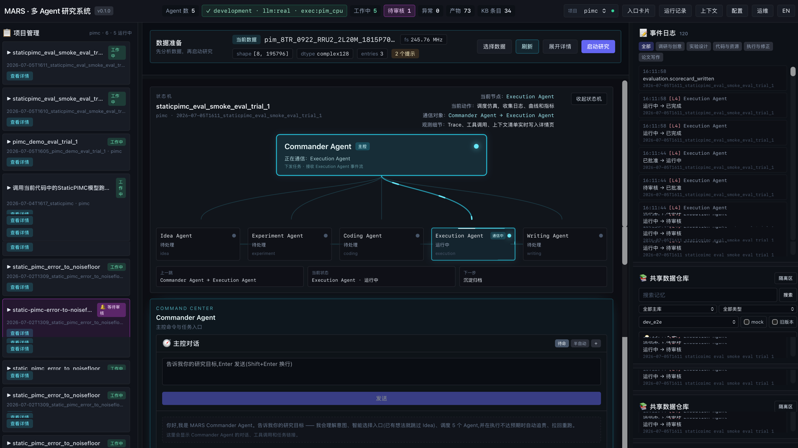
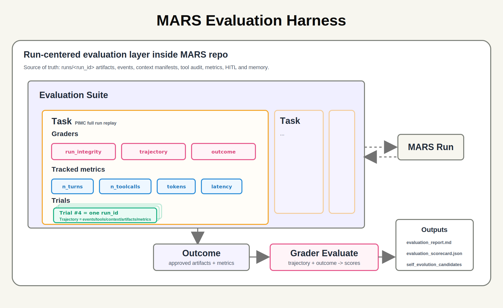
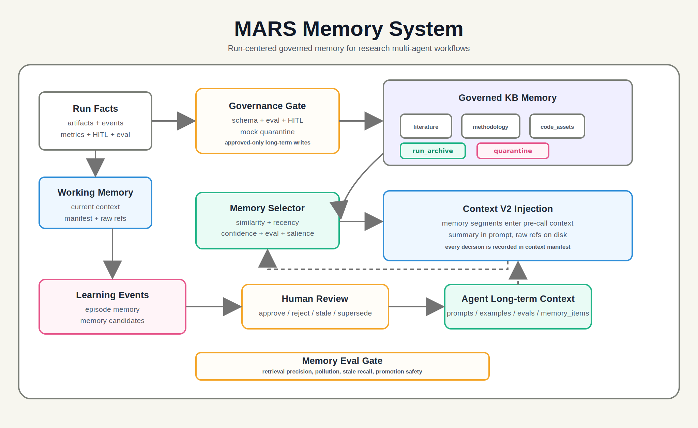
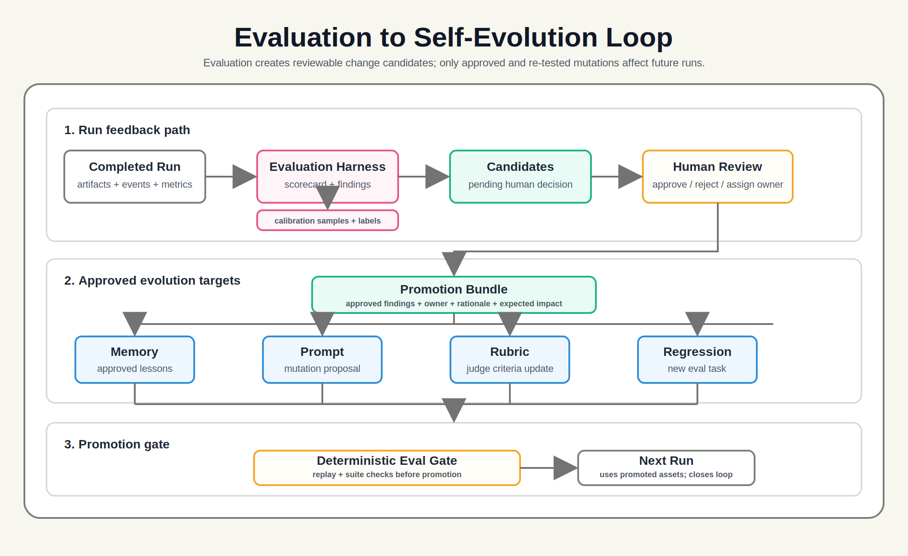
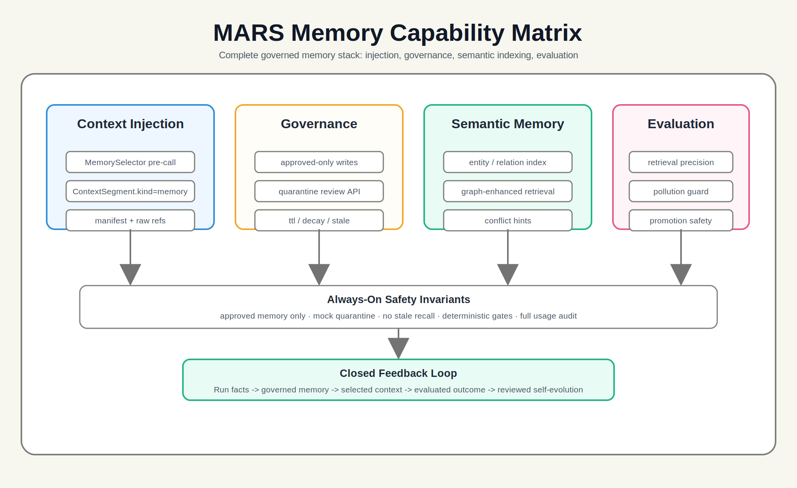

# MARS - Multi-Agent Research System


> MARS is a research-grade multi-agent workbench that turns a research
> question into auditable proposals, experiment plans, code specs, execution
> logs, reports, memory, and evaluation records.

[简体中文](README.zh-CN.md) · English · [Architecture](docs/architecture.md) · [Evaluation](docs/evaluation_system.md) · [Memory](docs/memory_system.md)

<p align="center">
  
</p>

## Why MARS

Research automation fails when it becomes a one-shot chat transcript. MARS is
designed as a substrate for repeatable research work:

- five specialized agents instead of one generic assistant
- strict artifact schemas instead of loose prose
- human review and approval at each step
- project-level baseline protection before code changes land
- run sedimentation so every decision can be inspected, replayed, and evaluated
- memory and evaluation loops that improve future runs without hiding evidence

The first concrete project is `projects/pimc/`: PIMC for FDD Massive MIMO under
beam/layer switching.

## Visual Tour

### Workbench

The main workbench keeps project state, data preparation, run history, agent
state, execution artifacts, and HITL controls in one operator-focused screen.

<p align="center">
  
</p>

### Evaluation And Memory

MARS V2 adds a first-class evaluation harness and memory layer. Evaluation
suites can replay stored runs, grade artifacts, export calibration data, and
feed self-evolution records back into the knowledge system.

<p align="center">
  
  
</p>

<p align="center">
  
  
</p>

## What Is In Mars_V2.0

Mars_V2.0 is the current development line. It includes the original mock-first
multi-agent pipeline plus the newer V2 workbench, evaluation, memory, and data
preparation surfaces.

| Area | What it does |
|---|---|
| Agent pipeline | Idea, Experiment, Coding, Execution, and Writing agents produce schema-validated artifacts. |
| Bridge runtime | Product calls go through `backend/app/bridge/`, with topology assembled outside `harness/runtime`. |
| HITL | Agent outputs can be reviewed, edited, approved, or rejected before downstream agents continue. |
| Gates | System gates protect workflow quality; Gate 5 protects baseline-sensitive project surfaces from unsafe tool dispatch. |
| Data preparation | Users can upload/select datasets, inspect metadata, and carry selected data into run context. |
| Evaluation harness | Replay/live-smoke suites, calibration export, score aggregation, and suite reports. |
| Memory system | Episode, semantic, importance, usage, conflict, injection, and selector-policy helpers. |
| Knowledge base | Four zones: literature, methodology, code assets, and run archive. |
| Post-training boundary | V0 loads post-trained models; training pipelines remain V2+ scope. |

## Agent Flow


Every artifact is Markdown body plus YAML frontmatter. The frontmatter must pass
its JSON Schema before downstream systems treat it as valid.

## Architecture

```text
frontend -> api -> bridge -> agents
bridge / agents -> harness
harness/runtime does not depend on bridge or agents
```

The important boundary is that `harness/` is agent-agnostic. It owns runtime
mechanics, schemas, context loading, LLM adapters, KB access, gates, tools,
evaluation, memory, and sedimentation. Product orchestration lives in
`bridge/`.

```text
backend/app/
  api/          FastAPI routes and WebSocket entrypoints
  bridge/       product orchestration, commander, agent registry
  agents/       Idea, Experiment, Coding, Execution, Writing
  harness/      runtime, schema, context, llm, kb, gates, tools, eval, memory
  hitl/         review, approval, audit helpers
  execution/    simulation and paper-static adapters
  storage/      run, artifact, context, data-source, self-evolution stores
```

## Quickstart

The default path runs without API keys or a GPU. Missing LLM credentials fall
back to `mock_provider`; missing execution hardware falls back to mock or CPU
simulation paths.

```bash
git clone git@github.com:HarryYangthu/MARS-Multi-Agent-Research-System.git mars
cd mars
cp .env.example .env

python3.11 -m venv .venv
source .venv/bin/activate
pip install -e ".[dev]"

PYTHONPATH=backend .venv/bin/python -m uvicorn app.main:app \
  --host 127.0.0.1 --port 8000
```

In another shell:

```bash
cd frontend
npm install --legacy-peer-deps
NEXT_PUBLIC_BACKEND_URL=http://127.0.0.1:8000 \
NEXT_PUBLIC_WS_URL=ws://127.0.0.1:8000 \
npm run dev -- -p 3000
```

Open `http://127.0.0.1:3000`. If port `3000` is occupied, use `-p 3001`.

## Useful Commands

```bash
# backend unit tests
PYTHONPATH=backend:posttrain/src uv run pytest backend/tests/unit -q

# focused V2 evaluation / memory tests
PYTHONPATH=backend:posttrain/src uv run pytest \
  backend/tests/unit/test_evaluation_calibration.py \
  backend/tests/unit/test_evaluation_suite_report.py \
  backend/tests/unit/test_memory_system_complete.py \
  backend/tests/unit/test_run_evaluation_replay.py -q

# type/import checks
PYTHONPATH=backend:posttrain/src uv run mypy --strict backend/
PYTHONPATH=backend:posttrain/src uv run lint-imports

# frontend typecheck
cd frontend && npm run typecheck

# run evaluation suites
python scripts/run_evaluation_suite.py --suite configs/evaluation_suites/mars_run_replay_v0.yaml
python scripts/run_evaluation_suite.py --suite configs/evaluation_suites/mars_live_smoke_v0.yaml
```

## Working With Real Models

Put provider credentials in `.env` or `.env.local`. Do not commit real keys.

```bash
DEEPSEEK_API_KEY=
DEEPSEEK_BASE_URL=https://api.deepseek.com/v1
OPENAI_API_KEY=
ANTHROPIC_API_KEY=
QWEN_API_KEY=
GEMINI_API_KEY=
```

Each agent has its own model config in `configs/agents.yaml`. The frontend
config workbench can update model routing while keeping secrets in ignored
local env files.

## Working With Real Research Code

Do not copy real research repositories into this repo. Link them through
`projects/<name>/repo_link.yaml`:

```bash
ln -s /path/to/your/research/code workspace/repos/pimc-current
python scripts/ingest_repo.py --project pimc
```

Reference papers and uploaded datasets stay under ignored workspace folders:

```text
workspace/uploads/
workspace/repos/
knowledge/
runs/
```

## Repository Layout

```text
mars/
  AGENTS.md / PRODUCT.md / DESIGN.md / ACCEPTANCE.md / README.md
  configs/                 agents, tools, gates, knowledge, context, eval suites
  backend/app/
    api/                   REST and WebSocket routes
    bridge/                orchestrator, commander, registry, workflow service
    agents/                five concrete agents and debate helpers
    harness/               agent-agnostic runtime, schemas, memory, eval, tools
    hitl/                  review and approval flows
    execution/             simulation runners and static-paper adapters
    storage/               local stores for runs, artifacts, data, evolution
  frontend/                Next.js workbench
  projects/pimc/           project metadata, AGENTS.md, data_gen.py
  docs/                    architecture, evaluation, memory, run lifecycle
  scripts/                 demos, ingestion, evaluation, acceptance helpers
  templates/               artifact templates and code rules
```

## Documentation Map

- [`AGENTS.md`](AGENTS.md) - hard project constraints for coding agents
- [`PRODUCT.md`](PRODUCT.md) - product definition and agent responsibilities
- [`DESIGN.md`](DESIGN.md) - tiered architecture, schemas, and dependency rules
- [`ACCEPTANCE.md`](ACCEPTANCE.md) - V0 acceptance boundaries
- [`ACCEPTANCE_V2.md`](ACCEPTANCE_V2.md) - V2 development gate
- [`docs/architecture.md`](docs/architecture.md) - architecture notes and diagrams
- [`docs/evaluation_system.md`](docs/evaluation_system.md) - evaluation harness design
- [`docs/memory_system.md`](docs/memory_system.md) - memory system design
- [`docs/run_lifecycle.md`](docs/run_lifecycle.md) - one task from input to report
- [`docs/tools_catalog.md`](docs/tools_catalog.md) - tools, audit, and registry behavior
- [`docs/tool_security.md`](docs/tool_security.md) - Gate 5, rollback, and network policy
- [`docs/deployment_runbook.md`](docs/deployment_runbook.md) - production deployment notes

## License

MIT - see [LICENSE](LICENSE).

## Citation

If you use MARS in academic work, cite this repository:

```bibtex
@software{mars_multi_agent_research_system,
  title = {MARS: Multi-Agent Research System},
  author = {Harry Yang},
  year = {2026},
  url = {https://github.com/HarryYangthu/MARS-Multi-Agent-Research-System}
}
```
