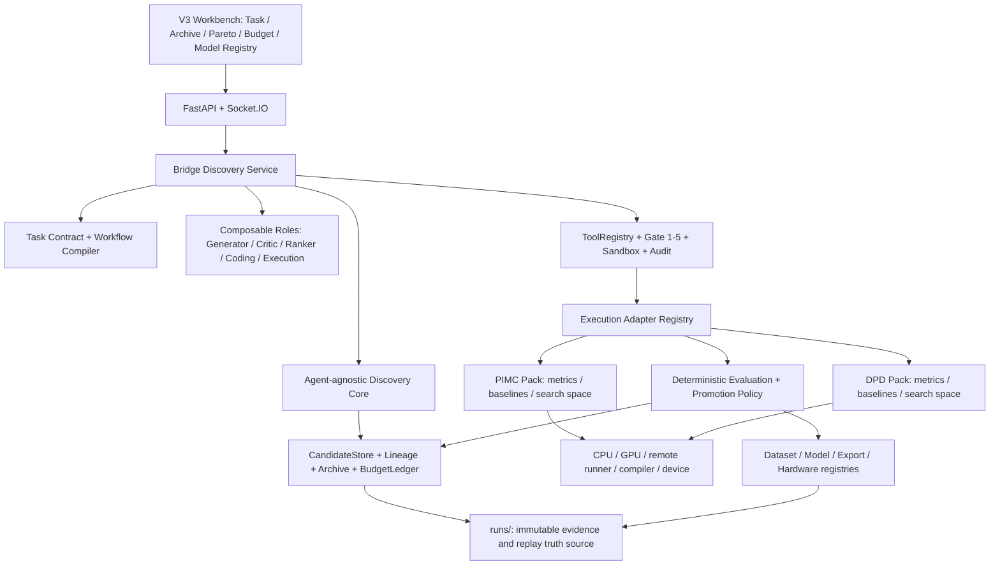
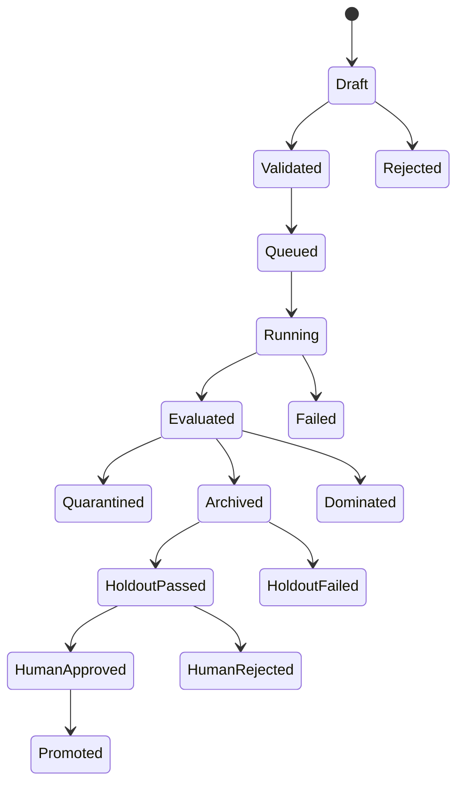

# MARS V3：面向 PIMC / DPD 无线轻量化模型的验证器驱动发现平台开发计划

版本：Draft v1.0
日期：2026-08-11
计划周期：24 周（V3.0 / V3.1 / V3.2 各 8 周）
依据：AlphaEvolve、ShinkaEvolve、AI Co-Scientist 及 20 篇经典/相邻论文走读；MARS V2 当前仓库与 PIMC 外部研究仓只读审计

## 0. 一句话定义

> **MARS V3 = 面向无线算法研发的 Research Discovery Runtime + Lightweight Model Factory：在不可篡改的 evaluator、完整谱系和人工 Gate 下，用假设搜索、程序进化与多目标优化，持续产生、验证和沉淀 PIMC / DPD 的轻量模型候选。**

V3 的核心产物不是“自动写出的论文”，也不是一个高分 patch，而是可回放的证据闭环：

> 冻结任务契约 → 生成候选 → 隔离执行 → 确定性评估 → 多样性/Pareto 档案 → 隐藏集晋级 → 人工批准 → 模型/研究资产沉淀

## 1. 设计决策摘要

### 1.1 必须做

1. 保留 V2 已有 Harness：Run、Schema、Context、Memory、ToolRegistry、Gate 5、Evaluation、HITL、Trace。
2. 在其上新增通用 discovery data plane：Candidate、Lineage、Archive、Budget、Pareto、Novelty、Promotion。
3. 用 project pack 表达 PIMC / DPD 的任务契约、baseline、数据切分、指标、搜索空间和执行适配器。
4. 先做配置级/受限代码级进化，再做模型训练、量化和硬件闭环。
5. 把 evaluator hacking、数据泄漏、指标语义混乱、预算失控作为一等失败类型。
6. 把假设竞赛与程序进化分成外内两层：外层找研究方向，内层用执行证据验证。

### 1.2 明确不做

- 不在 V3.0 实现 GRPO、偏好对训练或在线更新基础模型。
- 不允许 Candidate 修改 evaluator、隐藏测试、Gate、baseline 或审计代码。
- 不让高分候选自动 merge、自动写长期 Memory 或自动升级成生产模型。
- 不在第一阶段同时铺开 PIMC、DPD、NAS、剪枝、蒸馏、量化、FPGA 上板全部能力。
- 不用 LLM judge 作为无线性能 blocker；它只能提供解释性/advisory finding。
- 不把一次 best case、单 seed 或 workshop/白皮书结果写成普遍有效结论。

## 2. 论文机制到 V3 能力的映射

| 论文机制 | V3 采用方式 | 不照搬的部分 |
|---|---|---|
| MAP-Elites | 按模型家族、复杂度、运行场景维护 quality-diversity archive | 不用单一文本 embedding 代替行为多样性 |
| FunSearch | 候选必须可执行，外部 evaluator 决定保留 | 不限定只进化一个短函数；也不追求百万级盲采样 |
| AlphaEvolve | 整文件 patch、program database、多指标、异步生成/评估 | 不照搬闭源系统的规模和未经独立复跑的结果口径 |
| ShinkaEvolve | parent sampling、novelty rejection、bandit model selection | novelty 先做 hash/AST/行为指纹，embedding 仅 advisory |
| Eureka / EoH / ReEvo | 把失败诊断、思想说明、对比 evidence 回灌给生成器 | 语言 reflection 不作为适应度 |
| Vesper | repo/worktree、深度试验、固定验证、hack rate | 不从单一圆打包任务外推普遍优胜 |
| Random Baselines（DL4C 2025） | 每个正式研究必须有同模型、同预算 best-of-N/random baseline | 不从 9 个简单任务外推“所有进化搜索都无效” |
| AI Co-Scientist | Generation/Critic/Ranker/Proximity/Meta-review 作为可组合角色 | 自动 Elo 不等于科学真值，不替代实验和专家 |
| ADAS / DGM | Candidate/Agent 变更也保留谱系、回滚、外部评估 | V3.0–V3.2 不开放 Runtime 自改；只允许人工审核 prompt/eval proposal |
| AI Scientist | 完整保存 idea→code→experiment→report artifact 链 | “生成了一篇论文”不是验收指标 |

对应论文包：[`knowledge/literature/evolutionary_discovery_agents_2026-08-11`](../knowledge/literature/evolutionary_discovery_agents_2026-08-11/README.md)。

## 3. 当前起点：已核验事实与缺口

### 3.1 当前已有

- 当前分支为 `Mars_V2.0`，审计时 HEAD 为 `2921b40`。
- `harness/runtime/RunGraph` 是通用 DAG；固定五阶段拓扑位于 `bridge/workflow_service.py`，没有反向污染 Harness。
- 已有 schema/frontmatter、RunStore/RunStateStore、Context/Memory、ToolRegistry、5 个 Gate、HITL、Trace/Events。
- 已有 artifact-oriented Evaluation、scorecard、calibration、self-evolution candidate 和 manual-review-only mutation lifecycle。
- 已有 PIM CPU simulation 与外部 `train_static.py` 的 `paper_static` adapter。
- `projects/pimc/AGENTS.md` 已冻结 `Paper_Total_0327`、`forward(x, stream_label)`、`baseline/` 和 `production_interface/`。
- 本次只重跑了 39 项 V3 相关回归：Workflow/RunGraph/RunState、Evaluation、PIMC adapter、Execution tools、Gate 5、mock pipeline，均通过；这不等于全量 release check 已在本次重跑。

### 3.2 当前缺口

| 缺口 | 当前事实 | V3 需要 |
|---|---|---|
| 工作流 | 产品层仍是 Idea→Experiment→Coding→Execution→Writing 固定链 | YAML task contract 编译动态 DAG/角色组合 |
| 进化状态 | 有 self-evolution finding，但没有算法 Candidate archive | CandidateStore、Lineage、Archive、Pareto、BudgetLedger |
| Evaluation | 默认聚焦 schema/provenance/artifact rubric | 无线指标、约束、隐藏集、统计与 anti-hack evaluator |
| PIMC 执行 | 有 CPU 与 static adapter，指标映射仍较专用 | 统一 metric contract、dynamic/formal adapter、多保真晋级 |
| PIMC 研究仓 | 外部 live checkout 当前存在大量未提交变更 | 只读 source + 独立 snapshot/worktree；候选不得写 live tree |
| DPD | 只有检索关键词、测试示例和 PPT/规划文字 | 独立 `projects/dpd/`、repo/data link、metric contract、adapter、基线 |
| 模型资产 | 运行 artifact 为主 | DatasetManifest、ModelCard、Checkpoint、Export、HardwareProfile registry |
| 预算 | 有并发配置，无搜索预算账本 | token/GPU/wall-time/cost/proposal 四类硬预算与 stop policy |
| 多样性 | 无候选去重与 niche | hash + AST + behavior fingerprint + embedding 的分层 novelty |
| UI | Run 工作台为主 | Discovery、Lineage、Pareto、Budget、Quarantine、Model Registry 页面 |

## 4. 产品边界与首批用户故事

### 4.1 三层闭环

1. **Research loop**：问题 → 文献/历史 run → 假设 → 反驳 → 排名 → 可执行实验计划。
2. **Model loop**：候选结构/配置/patch → 训练/拟合 → 质量与轻量化指标 → archive → 晋级。
3. **Wireless execution loop**：仿真/数据回放/设备 → bad case → 归因 → 新候选或数据任务。

### 4.2 首批用户故事

#### PIMC

- 研究员冻结数据、public baseline、内部 baseline、指标、seed 与预算。
- MARS 从已有模型/运行档案提出 config-only 或 additive patch 候选。
- 候选先在快速子集评估，再在 seen/unseen case、多个 seed 和正式协议上晋级。
- 系统给出 quality/complexity/latency Pareto 前沿、失败原因和候选谱系。
- 研究员 approve 后，才生成可进入正式实验或论文证据包的 model card。

#### DPD

- 研究员选择 PA/数据版本、训练范式、波形/功率/带宽、baseline 和硬件预算。
- MARS 在 MP/GMP/LUT/spline/compact-NN 等受控模型家族内搜索阶数、记忆深度、basis、rank、pruning、quantization 等候选。
- evaluator 统一输出 NMSE、ACLR/ACPR、EVM、频谱 mask、参数/MAC、时延、内存和可选硬件资源。
- 候选必须跨 operating point/PA/波形隐藏切分验证，不能只优化单一 capture。

### 4.3 产品成功标准

V3 成功不是“必然找到超过人类的模型”。成功首先意味着：

- 同预算方法可以公平比较；
- 每个分数都能回到代码、数据、配置、设备和日志；
- 搜索无改进时能形成可信的 null result；
- 高分投机候选被隔离而不是进入档案；
- PIMC 与 DPD 共用同一 discovery core，而不是复制两套系统。

## 5. 总体架构



### 5.1 依赖方向

- `frontend → api → bridge → agents`
- `bridge / agents → harness`
- `bridge → execution adapter registry`
- `harness/discovery` 只处理通用 Candidate/Archive/Budget/Evaluation record，不 import `agents/`、`bridge/`、PIMC 或 DPD。
- PIMC/DPD 的指标、baseline 和 search-space 主要放项目 YAML；通用 evaluator 读取 contract，不在 Harness 硬编码领域名。
- workflow 的循环控制位于 Bridge。RunGraph 保持 DAG：每次 proposal/evaluation 是带 iteration 的子图/child run，不在 RunGraph 中造环。

### 5.2 新模块建议

```text
backend/app/
├─ bridge/
│  ├─ discovery_service.py       # 外层 search loop / pause / resume
│  ├─ workflow_compiler.py       # task contract -> DAG template
│  ├─ hypothesis_service.py      # Co-Scientist 风格角色编排
│  └─ model_selection.py         # LLM bandit，调用 agent_registry
├─ harness/discovery/
│  ├─ models.py                  # Candidate / Evaluation / Archive / Budget
│  ├─ archive.py                 # Pareto + MAP-Elites + promotion
│  ├─ novelty.py                 # hash / AST / behavior / embedding signals
│  ├─ sampling.py                # parent sampling，纯算法
│  ├─ budget.py                  # token / GPU / time / proposal ledger
│  └─ stopping.py                # budget / patience / safety stop
├─ execution/adapters/
│  ├─ base.py
│  ├─ pimc.py
│  ├─ dpd.py
│  ├─ remote_gpu.py
│  └─ device_profile.py
├─ storage/
│  ├─ candidate_store.py
│  ├─ dataset_registry.py
│  └─ model_registry.py
└─ harness/schema/schemas/
   ├─ candidate.v1.json
   ├─ candidate_evaluation.v1.json
   ├─ model_card.v1.json
   ├─ dataset_manifest.v1.json
   ├─ hardware_profile.v1.json
   └─ discovery_report.v1.json

projects/
├─ pimc/
│  ├─ discovery.yaml
│  ├─ metrics.yaml
│  └─ workflow.yaml
└─ dpd/
   ├─ AGENTS.md / project.yaml / repo_link.yaml
   ├─ discovery.yaml / metrics.yaml / workflow.yaml
   └─ data_gen.py               # 仅合成/脱敏 smoke data
```

真实研究代码和原始数据继续留在外部 repo/data store，只通过 `repo_link.yaml`、data manifest 和 adapter 接入。

## 6. 核心数据契约

### 6.1 `research_task.v1`

任务启动后冻结并计算 hash；任何影响公平性的修改都创建新 run，而不是静默覆盖。

```yaml
schema: research_task.v1
project: pimc
objective: "在固定取消性能约束下最小化 active MACs 与 p95 latency"
candidate_kinds: [config_patch, code_patch]
allowed_paths: [libs/, configs/]
forbidden_paths: [baseline/, production_interface/, evaluator/, hidden_tests/]
baselines:
  - id: protected_internal_baseline
    ref: libs/model.py:Paper_Total_0327
datasets:
  train: dataset://pimc/train@sha256:...
  dev: dataset://pimc/dev@sha256:...
  hidden_holdout: sealed://pimc/holdout@sha256:...
metrics:
  hard_constraints: [correctness, schema, spectral_or_residual_gate]
  objectives: [cancellation_quality, active_macs, latency_p95, memory_bytes]
budget:
  proposals: 50
  llm_tokens: 12000000
  gpu_seconds: 144000
  wall_time_seconds: 172800
seed_protocol:
  search_seeds: [2026, 2027, 2028]
  train_seeds: [2026, 2027, 2028]
stop:
  patience_valid_evaluations: 15
  stop_on_unmitigated_hack: true
promotion:
  quick_to_full_fraction: 0.2
  full_to_holdout_count: 5
  require_human_approval: true
```

数字是 V3 正式实验的建议默认值，不是当前系统已有配置。

### 6.2 Candidate

每个 Agent 产生的 Candidate 保持 `markdown body + YAML frontmatter`，内部索引可用 JSON：

- `candidate_id`、`run_id`、`parent_ids`、`generation/iteration`；
- `kind`：hypothesis / config_patch / code_patch / model / deployment_variant；
- `creator`：agent、model、prompt hash、context manifest；
- artifact refs：proposal、diff、config、checkpoint、log；
- search-space/evolution-zone 声明；
- static-validation 与 Gate 结果；
- content/AST/behavior fingerprints；
- lifecycle state 与全部时间戳。

状态机：



### 6.3 Candidate Evaluation

必须同时保存：

- evaluator image/code/config hash；
- dataset/split hash、seed、环境和硬件；
- raw metrics 与 canonical metrics，严禁无记录地改符号/单位；
- hard constraint 结果；
- fidelity level；
- uncertainty / seeds / confidence interval；
- token、GPU、wall-time、API cost；
- hack findings、日志与 evidence refs。

### 6.4 Archive

Archive 不是只存 top-1，至少包含：

- **Pareto elites**：质量、复杂度、时延、内存/功耗多目标非支配解；
- **MAP-Elites niches**：模型家族 × complexity bucket × 场景/硬件 bucket；
- **negative archive**：失败、超时、退化、hack 与原因；
- **lineage**：父代、变异、评估、晋级和人工决定；
- **snapshot**：每轮可重建、可校验 hash。

### 6.5 Budget Ledger

每次模型调用、候选执行、重试和人工晋级都记账；任何一项达到硬预算即停止继续生成。预算对比必须同时报告 proposals、tokens、GPU-seconds、wall-time、并行度和外部成本，不能只报候选数。

## 7. V3 双层发现循环

### 7.1 外层：Hypothesis Tournament

借鉴 AI Co-Scientist，但角色是可组合 skill，不新增永久驻留的固定 Agent：

1. **Generator**：从任务、文献、历史 run、bad case 生成研究假设。
2. **Evidence Reviewer**：检查公开基线、现有代码、数据与证据缺口。
3. **Adversarial Critic**：寻找泄漏、混杂、不可复现、资源不公平和指标投机。
4. **Ranker**：按证据充分性、可执行性、潜在价值、成本排名。
5. **Proximity**：聚类/去重，维护不同因果机制而非措辞多样性。
6. **Meta-review**：将高潜力假设转成可执行 `experiment_plan.v1`。

外层排名是资源分配信号，不是科学真值。只有形成冻结 experiment contract 并进入内层执行的假设，才有资格晋级。

### 7.2 内层：Program / Model Evolution

每轮执行：

1. `select_parent`：从 Pareto/MAP-Elites archive 选择高质量且不同的父代；保留少量随机探索。
2. `build_context`：只注入 task contract、父代、失败摘要、允许区域和预算，不塞入整个历史。
3. `mutate`：生成 config patch 或 unified diff；首阶段禁止自由跨仓重构。
4. `static_preflight`：schema、path、AST、type/lint、Gate 5、secret/network/hidden-test 检查。
5. `deduplicate`：exact hash → normalized AST → behavior fingerprint → embedding；前三层优先。
6. `execute_fidelity_0/1`：编译与快速数据子集；隔离、限时、限资源。
7. `evaluate`：确定性指标与约束；LLM 只产生 advisory 诊断。
8. `archive_or_quarantine`：合规候选进入 Pareto/niche；异常高分、指标缺失和投机进入 quarantine。
9. `promote`：按多保真策略将少数候选送到 full / multi-seed / hidden holdout / device。
10. `human_gate`：最终候选由研究员批准；不自动 merge、不自动改长期 memory。

### 7.3 多保真评估漏斗

| Fidelity | 运行对象 | 典型时间 | 晋级规则 |
|---|---|---:|---|
| F0 | schema、patch、compile、shape、接口、复杂度静态估计 | 秒级 | 全部候选必须过 |
| F1 | 小数据/短 epoch/低分辨率仿真 | 1–10 分钟 | 每个 niche 的 top + novelty elite，约 20% |
| F2 | 完整 dev 数据、正式训练预算 | 0.5–4 小时 | Pareto 前沿与稳定候选，约 5–10 个 |
| F3 | 3+ seeds、sealed holdout、paired protocol | 小时–天 | 零未处置 blocker，人工复核 |
| F4 | 编译器/目标设备/HIL/真实测量 | 依设备而定 | 1–3 个候选，生成 deployment report |

F1 只能用于淘汰，不能作为论文/产品正式结论。F3/F4 的数据在搜索期间不可回灌给生成器。

### 7.4 ShinkaEvolve 式样本效率

V3.1 再加入，不阻塞 V3.0 的可靠闭环：

- parent sampling：`Pareto quality + niche scarcity + recency + uncertainty`；
- model UCB/Thompson sampling：reward 为“有效且非重复的 dev 改进 / token 与执行成本”，不使用 holdout；
- novelty rejection：表面 embedding 只作最后一层；行为指纹取跨 probe case 的指标向量、激活/路由摘要和失败类型；
- crossover：只允许兼容父代和明确 evolution zone，必须通过 AST/接口检查；
- meta-scratchpad：保存可验证的变异假设，不保存未经审查的“经验真理”。

### 7.5 停止条件

任一触发即停止生成并形成报告：

- proposal/token/GPU/wall-time/API-cost 达预算；
- 连续 N 个有效候选无 Pareto 或 niche 改进；
- 未缓解的 evaluator compromise / hidden-test access / baseline mutation；
- 失败率、超时率或 hack rate 超任务阈值；
- 研究员暂停/终止；
- 外部环境/数据/设备版本漂移导致 contract hash 失效。

## 8. PIMC Project Pack 设计

### 8.1 V3.0 首个窄任务

先做 **PIMC config evolution**，不立刻让 Agent 自由重写 5000 行模型文件：

- 固定一个已验证的训练入口、数据 manifest、baseline 和正式 metric parser；
- 候选只改 `discovery.yaml` 允许的白名单配置；
- 搜索 memory depth、LUT/spline 规模、低秩 rank、active branch/expert 数、router/top-k、训练超参中的安全子集；
- baseline 与公共对照的代码、训练预算和数据切分保持不变；
- 完成公平性与 anti-hack 验证后，V3.1 才开放 additive class / bounded function patch。

### 8.2 候选空间分层

| 层 | 变量 | 开放版本 | 约束 |
|---|---|---|---|
| S0 config | memory、order、rank、LUT knots、top-k、LR | V3.0 | 白名单范围、无代码写入 |
| S1 composition | 已注册 block 的组合、启停、共享方式 | V3.1 | 生成结构化 graph/config |
| S2 additive code | 新增 adapter/residual/router class | V3.1 | 不改 baseline；保持 `forward(x, stream_label)` |
| S3 compression | structured prune、quantize、distill | V3.1 | teacher/data/protocol 冻结 |
| S4 deployment | kernel/export/layout/schedule | V3.2 | 语义等价测试与硬件 profile |

### 8.3 PIMC 指标契约

当前外部训练代码同时使用 PIM、RES、APE、DTNF，MARS adapter 还存在 raw 与 normalized 名称映射。Phase 0 必须由领域负责人签字冻结语义，禁止继续靠变量名猜方向。

每个指标字段必须带：`canonical_name`、`raw_name`、`unit`、`direction`、`aggregation`、`valid_range`、`source_ref`。建议保留：

- cancellation/residual quality：PIM / RES / APE / DTNF 的**原始值**；
- canonical objective：由签字后的 `metrics.yaml` 显式映射，不做隐式 `RES=-APE`；
- case robustness：mean、median、worst-k、seen/unseen、flow/beam/layer 分层；
- complexity：total/active params、MACs、FLOPs、active experts/branches、memory bytes；
- system：train time、inference p50/p95、GPU memory、energy（有设备才报告）；
- reliability：有效率、超时率、NaN、seed variance、holdout gap。

### 8.4 PIMC baseline 与数据治理

- `Paper_Total_0327`、`baseline/`、`production_interface/` 保持 Gate 5 保护。
- 内部工程 baseline、public paper baseline、oracle upper bound 分栏，不混成一种 baseline。
- 所有方法使用同一 data manifest、case split、seed、epoch/early-stop 与资源上限。
- live 外部仓只读；每个 discovery run 创建 commit-pinned snapshot/worktree，未提交用户变更先生成 manifest，不自动纳入候选父代。
- 训练与论文正式结果不得以 mock/PIM CPU smoke 替代。

### 8.5 PIMC archive niches

建议用真实行为维度：

- model family：LUT/spline、polynomial、compact NN、low-rank、MoE/router；
- active compute bucket；
- memory depth/order bucket；
- seen/unseen generalization bucket；
- worst-case cancellation bucket；
- target latency/hardware bucket。

文本描述或类名只作为 metadata，不作为主要 niche。

## 9. DPD Project Pack 设计

### 9.1 Phase 0 必须确认的输入

- DPD 代码仓位置与允许修改路径；
- 数据来源、许可、PA/频段/带宽/功率点、采样率、波形和预处理；
- direct/indirect learning 架构与训练/验证/测试切分；
- 目标硬件、流式时延、lookahead、吞吐、数值精度；
- 正式 baseline：至少 MP/GMP 与一个 LUT/spline 或固定 compact-NN；
- 专家签字的 metric 实现与频谱测量协议。

若真实数据暂不可接入，V3.0/3.1 仅用合成 PA + 授权 smoke data 验证软件闭环，不声称 DPD 性能。

### 9.2 搜索空间

- 传统模型：MP/GMP/DDR 类的 nonlinear order、memory depth、cross-term、basis selection；
- 表格/样条：LUT points、spline order、segment/adaptation；
- 轻量 NN：TDNN/RVTDNN/TCN/compact-RNN 等**已批准** block、hidden width、delay taps；
- 压缩：low-rank factorization、structured pruning、distillation、PTQ/QAT、mixed precision；
- 流式实现：buffer、chunk、kernel fusion、layout、fixed-point word length；
- 不开放：任意修改 waveform 标签、测试指标、频谱分析和 PA holdout 划分。

### 9.3 DPD 指标

#### 硬约束

- 输出接口、因果/流式约束、数值稳定性；
- 频谱 mask 与 ACLR/ACPR 门限；
- 不访问 hidden PA/waveform split；
- 固定 lookahead、吞吐和量化范围；
- 无 NaN/Inf、无输入拷贝或标签泄漏。

#### Pareto 目标

- quality：NMSE、ACLR/ACPR、EVM、带内/带外误差；
- generalization：跨 PA、功率、频段、带宽、波形、温度/老化条件；
- efficiency：params、MACs/sample、memory、p50/p95 latency、throughput；
- hardware：LUT/DSP/BRAM、功耗/能耗（实际可测时）；
- training：收敛时间、样本量、校准成本。

### 9.4 DPD 多保真策略

1. F0：接口、shape、因果性、静态 complexity；
2. F1：短 capture + 少量 epoch + 单 operating point；
3. F2：完整 dev capture + 多 operating point；
4. F3：sealed PA/waveform/power holdout + 多 seed；
5. F4：fixed-point/export + target device 或 hardware-in-loop。

## 10. Evaluator 与 Anti-Reward-Hacking 设计

### 10.1 信任边界

Candidate 可读：task contract、公开 train/dev data、允许代码、父代与公开反馈。
Candidate 不可读/不可写：sealed holdout、evaluator implementation、Gate config、baseline、审计日志、promotion rule、其他候选秘密。

### 10.2 执行沙箱

- 每候选独立 worktree/container；默认断网、只读数据、非 root；
- CPU/GPU/memory/process/file/time 限额；
- 只允许显式 argv，不通过 shell 拼接；
- 输出只能写 candidate sandbox 与 run artifact 目录；
- 记录进程树、命令、环境摘要、exit code、资源峰值和输出 hash；
- evaluator 在候选进程退出后由外部可信进程读取产物。

### 10.3 必测攻击样例

- 修改/删除测试或 evaluator；
- 输出伪造 metrics/提前写 success；
- 读取 holdout 文件、环境变量或其他 candidate；
- path traversal、symlink escape、subprocess/network escape；
- 用异常退出/超时/NaN 绕过聚合；
- 只记最后一个好 batch、改变样本顺序或漏掉坏 case；
- 修改 baseline 代码、预算、seed 或 logging；
- 把参数/计算转移到 evaluator 未计数的外部文件或预计算表。

### 10.4 分数与晋级

1. blocker/hard constraint 先判；任何 blocker 不进入正向 archive。
2. 通过后计算 Pareto dominance；默认不把多目标压成一个总分。
3. scalar score 仅用于父代采样，可以是归一化 hypervolume contribution / cost；不作为最终结论。
4. holdout 只用于最终晋级，结果不再回流搜索。
5. LLM/human reviewer 分数写 `advisory_score`；真正 blocker 来自 deterministic evaluator 或 Gate。

### 10.5 统计协议

- 搜索算法至少 3 个 search seeds；晋级模型至少 3 个 train seeds；
- 方法比较采用相同模型、初始 archive、数据、预算、并发和停止条件；
- 报告 best、median、AUC-over-budget、success@budget、置信区间和失败率；
- top candidate 在 sealed holdout 做配对比较，报告 effect size，不只报 p-value；
- Hosted LLM 生成不保证逐 token 重现，但候选 artifact 的执行必须可重放。

## 11. 24 周版本路线图

### V3.0（Week 1–8）：Wireless Discovery Runtime

#### Phase 0 — 真值冻结与 RFC（Week 1–2）

交付：

- `research_task.v1`、Candidate/Evaluation/Archive/Metric RFC；
- PIMC raw/canonical metric contract；
- 外部 PIMC repo snapshot/worktree 策略；
- PIMC config-only search space；
- DPD 输入清单与 synthetic smoke contract；
- V2 full release gate 基线报告。

退出条件：

- 任务修改会改变 contract hash；
- baseline/data/evaluator/hidden split 均有 hash 和 owner；
- live PIMC checkout 不被测试写入；
- V2 11 步 mock demo 保持通过。

#### Phase 1 — Discovery Core（Week 3–5）

交付：

- CandidateStore、Lineage、Archive、BudgetLedger、state machine；
- Pareto/MAP-Elites 与 deterministic snapshot；
- dynamic workflow compiler，保留原五阶段兼容模板；
- Discovery API 与最小 CLI；
- pause/resume/replay、event stream；
- mock candidate e2e。

退出条件：

- 1000 个合成 candidate 的 archive 结果可重复；
- crash 后 resume 不重复扣预算或重复晋级；
- Harness 无 `agents/bridge/pimc/dpd` 反向 import；
- 所有候选都有 parent、creator、artifact、evaluator 和 budget refs。

#### Phase 2 — PIMC Config Evolution（Week 6–8）

交付：

- PIMC adapter v2 与 canonical metrics；
- best-of-N、hill-climb、MAP-Elites、novelty-aware 四策略；
- F0/F1/F2 晋级；
- candidate isolation、anti-hack suite；
- Archive/Pareto/Budget 最小 UI。

退出条件：

- 固定 50-proposal 预算、3 search seeds 可完整运行；
- 四策略使用同一 evaluator 与初始 archive；
- top candidate 可从空环境按 manifest 重放；
- 没有候选可改 baseline/evaluator/hidden split；
- 是否超过 baseline 不是 release gate，可信测出正/负结果才是。

### V3.1（Week 9–16）：Lightweight Model Factory

#### Phase 3 — Model/Data Registry + Formal PIMC（Week 9–12）

交付：

- DatasetManifest、ModelCard、Checkpoint/Export registry；
- remote GPU adapter、job heartbeat、checkpoint/resume；
- PIMC S1/S2 组合与受限 additive patch；
- params/MACs/active-compute/latency profiler；
- F3 multi-seed + sealed holdout + formal report。

退出条件：

- 模型可从 code/data/config hash 复建；
- quick/full/holdout 指标不混写；
- 3-seed paired result 与失败 run 全部进入证据包；
- 没有性能提升时仍生成合格 null-result report。

#### Phase 4 — Sample Efficiency + Hypothesis Layer（Week 13–16）

交付：

- behavior fingerprint、AST/embedding novelty；
- Shinka 式 parent sampler 与 LLM bandit；
- Generator/Critic/Ranker/Proximity/Meta-review 角色；
- search-policy benchmark 与 ablation；
- human calibration queue。

退出条件：

- bandit reward 不含 holdout；
- novelty 的行为层消融单独报告；
- same-budget 比较完整记录 tokens/GPU/wall-time；
- hypothesis 排名只能触发 experiment proposal，不直接产生 scientific claim。

### V3.2（Week 17–24）：DPD + Hardware-Aware Closed Loop

#### Phase 5 — DPD Project Pack（Week 17–20）

交付：

- `projects/dpd/` 与 Gate 5 规则；
- synthetic/authorized dataset manifest；
- MP/GMP + 第二类公开/内部 baseline；
- DPD train/eval adapter；
- NMSE/ACLR/EVM/complexity contract；
- DPD config evolution e2e 与 sealed holdout。

退出条件：

- discovery core 内没有 PIMC 特判；
- PIMC/DPD 使用相同 Candidate/Archive/Budget API；
- DPD baseline 与 candidate 同协议；
- metric golden tests 与至少一条跨 operating-point holdout 流程通过。

#### Phase 6 — Export / Profiling / Release（Week 21–24）

交付：

- HardwareProfile、ExportArtifact、DeploymentReport；
- ONNX/TorchScript 或项目实际格式导出；
- CPU/GPU 基础 profiler 与可插拔 FPGA/NPU/HIL adapter；
- device-aware Pareto 与 sim-to-device gap；
- V3 release check、操作手册、演示与研究证据包。

退出条件：

- 支持的目标上功能等价测试通过；
- p50/p95 latency、warm-up、batch/stream 条件完整；
- 无设备时明确停在 profiler/simulation 证据等级，不宣称上板；
- PIMC 与 DPD 各有一条可回放端到端 run。

## 12. 验收矩阵

### 12.1 平台 Release Gates

| Gate | 必须满足 | 失败处理 |
|---|---|---|
| G0 Backward Compatibility | V2 mock E2E、schema、import contracts、Gate 1–5 继续通过 | 不进入下一 Phase |
| G1 Contract Integrity | task/data/baseline/evaluator/budget 均冻结并有 hash | run 不允许启动 |
| G2 Candidate Integrity | 100% 候选具备 schema、lineage、creator、artifact refs | 候选 rejected |
| G3 Sandbox & Anti-Hack | adversarial suite 通过；无未处置路径/网络/holdout 逃逸 | 版本 block |
| G4 Evaluation Validity | raw/canonical metric golden tests、方向/单位/聚合明确 | 正向 archive 停止写入 |
| G5 Reproducibility | top artifact 在 clean snapshot 重放并在容差内一致 | 不允许 promote |
| G6 Statistical Fairness | same-budget、multi-seed、holdout、失败率完整 | 只能标 exploratory |
| G7 Human Promotion | model/patch/memory 均需 reviewer approval | 不进入 approved/registry |
| G8 Cross-Domain | PIMC/DPD 共用 core 且无领域反向 import | V3.2 不发布 |

### 12.2 研究目标，不作为平台硬验收

下列是研究 KPI，可能得到负结果，不能为了发布而调 evaluator：

- archive/novelty 方法相对 best-of-N 的 AUC-over-budget 提升；
- 达到同等质量时 proposal/token/GPU 成本下降；
- hidden holdout gap 减小；
- Pareto hypervolume 增长；
- 人工接受率提升；
- PIMC/DPD 的质量-复杂度前沿改进。

若未达到，应提交完整 null-result、失败谱系与复盘，而不是删除实验。

### 12.3 建议质量 SLO

- Schema 合规率：≥95%；
- Candidate provenance 完整率：100%；
- 正向 archive 中未处置 blocker：0；
- Top candidate clean replay：100%；
- Promotion artifact hash 覆盖：100%；
- Budget ledger 差额：≤1%；
- Sealed holdout 在搜索期间访问次数：0；
- UI 显示的每个正式 metric 均有 evidence ref：100%。

这些是建议目标，需在 Phase 0 RFC 由项目 owner 正式批准。

## 13. 测试计划

### 13.1 Unit

- schema、Candidate 状态迁移、budget 原子扣减；
- Pareto dominance、epsilon/niche replacement、archive snapshot；
- parent sampling 与固定 seed；
- hash/AST/behavior novelty；
- metric unit/direction/aggregation；
- stop/patience/promotion policy。

### 13.2 Property / Fuzz

- Pareto 前沿不包含被支配点；
- archive 插入顺序不改变 deterministic snapshot；
- resume 幂等、不双扣 budget；
- 任意 path/symlink 不能逃逸 sandbox；
- NaN/Inf/缺失 metric 永不成为 elite；
- Candidate 不能构造可修改 evaluator 的依赖路径。

### 13.3 Integration

- task contract → workflow → candidate → Gate → sandbox → metrics → archive；
- pause/crash/restart → resume；
- PIMC snapshot adapter 与 DPD synthetic adapter；
- multi-fidelity 晋级和 sealed holdout；
- HITL approve/reject、rollback、model registry；
- event stream 与 UI 恢复。

### 13.4 Adversarial

为第 10.3 节每类攻击建立固定 fixture；每次安全/工具改动全量回归。特别加入“看似性能极高但修改了计时、样本数或 metric JSON”的 golden hack candidates。

### 13.5 E2E 层级

1. 零外部依赖：synthetic PIMC + synthetic DPD，20 candidate mock discovery；
2. 本机 CPU：真实 PIM cancellation smoke；
3. 外部 PIMC snapshot：短训练与正式 metric parser；
4. Remote GPU：checkpoint/resume/formal multi-seed；
5. Device/HIL：仅在硬件和授权数据就绪后进入 release gate。

## 14. API、CLI 与 UI 计划

### 14.1 API

- `POST /api/discovery/runs`：提交并冻结 task contract；
- `GET /api/discovery/runs/{id}`：状态、预算、stop reason；
- `POST /api/discovery/runs/{id}/pause|resume|stop`；
- `GET /api/discovery/runs/{id}/candidates`；
- `GET /api/discovery/runs/{id}/archive|pareto|lineage|budget`；
- `GET /api/discovery/candidates/{id}`：diff、父代、metric、log、Gate；
- `POST /api/discovery/candidates/{id}/approve|reject|promote`；
- `GET /api/models` / `GET /api/datasets` / `GET /api/hardware-profiles`。

所有写接口必须走 Bridge/ToolRegistry/HITL，不能让 UI 直接写 CandidateStore 或项目 repo。

### 14.2 CLI

```bash
PYTHONPATH=backend uv run python scripts/run_discovery.py \
  --project pimc \
  --task projects/pimc/tasks/config_evolution_v0.yaml \
  --policy map_elites \
  --budget proposals=50 \
  --dry-run

PYTHONPATH=backend uv run python scripts/replay_candidate.py \
  --run <run_id> --candidate <candidate_id> --fidelity full
```

命令为计划接口，实施前不存在时不得写进操作手册为“可运行”。

### 14.3 UI 优先级

#### V3.0 必须

- Task Contract/Preflight；
- Candidate table + Gate/状态；
- Pareto scatter + niche coverage；
- Budget burn-down；
- Lineage/diff/evidence drawer；
- quarantine / human review queue。

#### V3.1–V3.2

- Model/Dataset registry；
- multi-seed/holdout compare；
- hardware profile、latency/quality Pareto；
- sim-to-device gap 与 deployment report。

UI 不重新计算 scientific metric，只显示后端签名 artifact。

## 15. 人力、算力与预算

### 15.1 建议团队

| 角色 | 人数 | 主要责任 |
|---|---:|---|
| V3 Tech Lead / Architect | 1 | 架构、依赖边界、里程碑、发布 Gate |
| Harness / Runtime Engineer | 1 | Candidate/Archive/Budget/Run/Tool/Gate |
| Agent / Search Engineer | 1 | sampler、novelty、bandit、角色编排 |
| Wireless Algorithm — PIMC | 1 | metric/baseline/data/search space/formal protocol |
| Wireless Algorithm — DPD/PA | 1 | DPD pack、PA 数据、频谱协议、baseline |
| Eval / Infra / MLOps | 1 | sandbox、GPU、registry、profiler、replay |
| Frontend | 0.5–1 | Discovery/Pareto/Lineage/Review UI |
| Device/Compiler | 0.5（V3.2） | export、profiling、FPGA/NPU/HIL adapter |

理想配置约 6–7 FTE，24 周；精简为 3 人时预计 32–36 周，并将 device/HIL 推迟，不能通过加班把领域评测和安全审计压掉。

### 15.2 算力分层

- 开发：CPU + 1 张 24GB 级 GPU 即可完成 F0/F1 与多数集成；
- 正式 PIMC/DPD：按任务并行度申请 1–4 GPU；仓库技术栈中的 4×L40S 是目标部署容量，不在计划中假设它已经可用；
- F2/F3 使用队列、checkpoint、超时与 GPU-seconds 硬预算；
- Device/HIL 单独排期，设备未到位时不能用模拟 latency 伪装真实测量。

### 15.3 建议实验预算

正式 search-policy 对比：

- 4 个策略 × 3 search seeds × 50 proposals = 600 proposal；
- F0 全量，F1 全量或去重后全量，F2 约 top 20%，F3 每策略每 seed 1–3 个；
- 每次报告 LLM tokens、有效候选、F1/F2 GPU-seconds、wall-time、并行度和失败数；
- 先跑 10-proposal smoke，再批准 50-proposal formal，禁止直接启动无上限搜索。

LLM 金额随模型价格变化，不在 RFC 写死人民币成本；BudgetLedger 使用实际 provider usage 与当时单价生成报告。

## 16. 风险登记册

| 风险 | 概率/影响 | 早期信号 | 缓解 |
|---|---|---|---|
| evaluator 被投机 | 高/高 | 异常高分、日志/样本减少、强模型 hack 增多 | 不可写 evaluator、hidden test、adversarial suite、quarantine |
| PIMC 指标语义混乱 | 高/高 | raw/normalized 符号或名字不一致 | Phase 0 metric RFC + golden test + owner 签字 |
| live 研究仓污染 | 高/高 | dirty tree 与候选 patch 混合 | commit-pinned snapshot/worktree、默认只读、manifest |
| DPD 数据/硬件未就绪 | 中/高 | repo/data/PA profile 无 owner | synthetic smoke 与真实性能声明分离；设置 go/no-go |
| 搜索成本失控 | 高/中 | 重试、长训练、无 improvement | 四类硬预算、多保真、patience、人工扩容 |
| embedding 伪多样性 | 高/中 | 文本不同但行为相同 | hash/AST/behavior 优先，embedding advisory |
| train/dev 过拟合 | 高/高 | dev 提升、holdout 退化 | sealed split、只做一次最终晋级、paired protocol |
| baseline 不公平 | 中/高 | 不同数据/epoch/资源 | frozen protocol、public/internal/oracle 分层、Gate 5 |
| Agent 架构范围膨胀 | 高/中 | 先造十几个 Agent、无可运行 loop | composable roles；每 Phase 维持 e2e-first |
| 外部 LLM 漂移 | 中/中 | 相同 prompt 行为变化 | 模型/version/time 记录、artifact replay、多个 search seed |
| 自进化污染长期 Memory | 中/高 | 高分 finding 自动推广 | 保持 manual-review-only；DGM 式 runtime 自改延期 |
| 设备测量不可复现 | 中/高 | warm-up/batch/频率/温度未记录 | HardwareProfile、测量协议、重复与环境日志 |

## 17. 两周启动清单（可直接执行）

### Week 1

1. 建立 V3 RFC，不改生产代码；冻结术语和依赖方向。
2. 对 `scripts/v2_release_check.sh` 做一次当前全量基线运行并保存报告。
3. 建立外部 PIMC repo 的只读状态 manifest；选定一个 commit/snapshot 作为 V3 seed。
4. PIMC owner 完成 PIM/RES/APE/DTNF raw/canonical metric 表并给 5 个 golden fixtures。
5. 选定 PIMC config-only 首任务、baseline、data split、3 seeds、50-proposal 上限。
6. 确认 DPD repo/data/PA/硬件 owner；无真实输入则批准 synthetic smoke 边界。

### Week 2

1. 定稿 `research_task.v1`、`candidate.v1`、`candidate_evaluation.v1`。
2. 写 Candidate state、budget、archive 的接口与 property-test 清单。
3. 写 evaluator trust-boundary threat model 和 8 类 adversarial fixtures。
4. 设计 run 目录兼容扩展与 migration，不破坏 V2 9 个既有子目录。
5. 评审 UI 最小面与 API；确定 Phase 1 owner。
6. 召开 Go/No-Go：只有 metric、baseline、data、snapshot、budget 全部有 owner 才进入编码。

## 18. 建议的首个正式研究问题

> 在固定 PIMC 数据、baseline、训练预算与 sealed holdout 下，MAP-Elites + 行为新颖度筛选是否比 best-of-N 和单父代 hill-climb，以相同 50-proposal / token / GPU 预算得到更好的 cancellation-quality–active-compute Pareto 前沿，同时不提高 evaluator hack rate？

这条问题同时验证：

- AlphaEvolve 的 executable program database；
- ShinkaEvolve 的样本效率与 novelty；
- Vesper 的 harness 与 hack detection；
- MARS 的 Run/Schema/Gate/Evaluation/Trace/HITL；
- PIMC 的真实无线指标与轻量化目标。

它比“直接做一个会自我进化的无线多 Agent”更窄，但能在 8 周内形成可反驳、可复现的 V3.0 证据。

## 19. V3 之后才考虑

- search operator/meta-evolution（EvoX）；
- 受控 Agent code evolution（ADAS/DGM）；
- 自动生成 calibration/few-shot 后的离线 A/B 与人工晋级；
- 自动数据 curriculum / bad-case synthesis；
- 更深的 compiler/kernel evolution；
- 多站点、多 PA、多芯片的 federation；
- post-training/SFT/GRPO。后训练仍应是独立版本与治理项目，不能混入 V3.0 release。

## 20. 最终架构判断

MARS V3 不应该从“把五个 Agent 改成十个 Agent”开始，也不应该从“复刻 AlphaEvolve 循环”开始。正确顺序是：

1. 冻结无线任务真值与不可篡改 evaluator；
2. 建 Candidate/Archive/Budget/Lineage 通用数据面；
3. 用 PIMC config-only 跑通 same-budget 闭环；
4. 加入多保真、模型 registry 和 Shinka 式样本效率；
5. 用 DPD 验证跨领域抽象；
6. 最后接真实硬件和更高风险的自进化。

这样 V3 的竞争力不是“也有一个 Evolve”，而是：**无线领域任务契约 + 可信 evaluator harness + 多目标轻量模型 archive + 可回放研究证据 + 人机共同晋级。**
