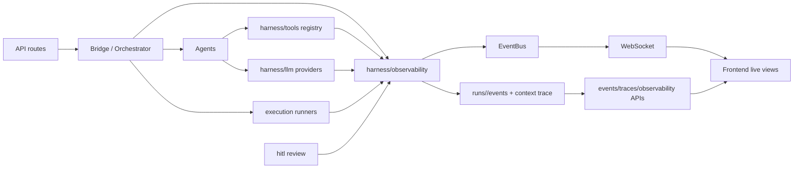

# MARS System Observability Design

> Scope: V0/V1 observability for the MARS multi-agent research system.
> Goal: make every run understandable, replayable, auditable, and debuggable
> without breaking the mock-first end-to-end demo path.

## 1. Design Goals

MARS observability must answer four operational questions:

1. Where is this run now?
2. Why did it stop, wait, retry, or fail?
3. Which agent, tool, gate, artifact, metric, or human action caused the current state?
4. Can we replay and audit the run from durable evidence on disk?

This is not only service monitoring. MARS is a research workflow, so
observability must connect runtime behavior to research artifacts:
`proposal -> experiment_plan -> code_spec -> run_log -> report`.

## 2. Principles

- **Run-scoped first**: `runs/<run_id>/` remains the source of truth for replay,
  audit, and post-training data construction.
- **E2E-first**: every observability change must preserve the zero-key,
  zero-GPU mock demo.
- **Schema-first**: structured event envelopes are preferred over ad hoc payloads.
- **Recoverable UI**: any live WebSocket view must be reconstructable from files
  and REST endpoints after refresh.
- **Harness boundary**: reusable observability primitives live under
  `harness/observability`; they must not import `agents/` or `bridge/`.
- **No silent bypass**: Gate, HITL, schema validation, tool dispatch, and execution
  failures must leave durable evidence.
- **Minimal capture by default**: prompts, tool args, and results are summarized or
  redacted unless explicitly configured.

## 3. Current Baseline

| Area | Current state | Gap |
| --- | --- | --- |
| Run directories | `RunStore` creates run subdirs and writes JSONL events. | Event payloads are not normalized. |
| Event bus | In-process pub/sub exists; Redis implementation exists. | API dependency currently wires in-process bus only. |
| WebSocket | Per-run and per-experiment endpoints exist. | Per-run endpoint does not subscribe to all useful run channels such as HITL and feedback loop. |
| Trace | `trace_manifest.v1.json` with node-level spans and event index exists. | LLM/tool/context spans are not yet captured. |
| Execution | Logs, curves, metrics, plots, per-experiment `run_log` are persisted. | UI mostly polls persisted curves; live experiment WS is not fully used. |
| HITL audit | `hitl/review_log.jsonl` records human actions. | HITL approve/reject bus events are not consistently persisted as websocket events. |
| Health/stats | `/health`, `/api/readiness`, `/api/stats` exist. | No SLO-style stuck-run or missing-heartbeat checks. |
| External telemetry | None required for V0. | OpenTelemetry/Prometheus/LangSmith should stay optional V1 sinks. |

## 4. Observability Signals

MARS uses six signals. Each signal has a live path and a durable path.

| Signal | Purpose | Durable path | Live path |
| --- | --- | --- | --- |
| Event | Immutable state/action fact | `runs/<id>/events/*.jsonl` | EventBus -> WebSocket |
| Trace | Causal timeline across agents/tools | `runs/<id>/context/trace_manifest.v1.json` | REST polling, future WS diff |
| Metric | Numeric run/system/outcome measurements | `execution/metrics.json`, `events/metrics.jsonl` | Execution WS, stats API |
| Log | Human-readable process output | `execution/logs/*.log`, app stderr | Execution WS |
| Audit | Human/gate decisions | `hitl/review_log.jsonl`, `events/gate_events.jsonl` | Run WS, global event log |
| Readiness | Admission and environment checks | API response, optional snapshot | `/api/readiness`, top bar |

## 5. Event Envelope

All new durable events should use one envelope. Existing events can be migrated
incrementally by wrapping old payloads under `payload`.

```json
{
  "schema": "event.v1",
  "event_id": "evt_01HY...",
  "timestamp": "2026-06-17T10:12:13.123456+00:00",
  "run_id": "2026-06-17T1012_pimc_demo",
  "project": "moe-pimc",
  "channel": "run.<run_id>.agent_state",
  "kind": "agent.state_changed",
  "severity": "info",
  "source": {
    "component": "bridge.orchestrator",
    "agent": "coding",
    "node": "coding"
  },
  "correlation": {
    "trace_id": "abc123",
    "span_id": "def456",
    "parent_span_id": "root"
  },
  "evidence": [
    "coding/code_spec.v1.md",
    "context/trace_manifest.v1.json#/spans/def456"
  ],
  "payload": {
    "from_state": "running",
    "to_state": "waiting_review"
  }
}
```

Required fields: `schema`, `event_id`, `timestamp`, `run_id`, `channel`,
`kind`, `severity`, `source`, `payload`.

Severity values: `debug`, `info`, `warning`, `error`, `critical`.

## 6. Event Kinds

Use stable dot notation. UI routes by prefix; analytics groups by kind.

| Kind | Producer | Notes |
| --- | --- | --- |
| `run.created` | API/Bridge | Includes task, project, entrypoint. |
| `run.started` | Bridge | First lifecycle event after start. |
| `run.completed` | Bridge | Includes final node states. |
| `run.failed` | Bridge | Includes failed node and error summary. |
| `agent.state_changed` | Bridge | Replaces ad hoc `agent_events`. |
| `agent.artifact_created` | Agent runner | Evidence points to `*.vN.md`. |
| `artifact.schema_validated` | Artifact/schema layer | Include schema id and error count. |
| `hitl.review_required` | Bridge/HITL | Evidence points to artifact version. |
| `hitl.approved` | HITL | Persist before graph advances. |
| `hitl.rejected` | HITL | Include reason if provided. |
| `gate.triggered` | Harness gates | Blocking gate decision evidence. |
| `gate.resolved` | Harness gates/HITL | Human/system resolution. |
| `tool.started` | Tool registry | Args are redacted by policy. |
| `tool.completed` | Tool registry | Include latency and ok/error. |
| `tool.blocked` | Tool registry/Gate 5 | Must include gate id. |
| `llm.requested` | LLM registry/provider | Prompt hash, model, provider. |
| `llm.completed` | LLM provider | Latency, tokens if available. |
| `llm.fallback_mock` | LLM registry | Explains mock downgrade. |
| `execution.started` | Execution runner | Per experiment. |
| `execution.log_line` | Log streamer | stdout/stderr line. |
| `execution.curve_point` | Simulation runner | Metric tick. |
| `execution.plot_updated` | Simulation runner | PNG snapshot updated. |
| `execution.completed` | Execution runner | Metrics and fingerprint. |
| `execution.failed` | Execution runner | Error summary. |
| `diagnosis.created` | Bridge Agent | Evidence points to diagnosis md. |
| `feedback_loop.review_required` | Bridge | Pauses run for human feedback. |
| `heartbeat` | Runtime worker | Agent/run liveness. |

## 7. Channel Model

Channels should be predictable and composable:

```text
run.<run_id>.lifecycle
run.<run_id>.agent_state
run.<run_id>.artifact
run.<run_id>.hitl
run.<run_id>.gate
run.<run_id>.tool
run.<run_id>.llm
run.<run_id>.diagnosis
run.<run_id>.feedback_loop
run.<run_id>.heartbeat
run.<run_id>.experiment.<experiment_id>
system.stats
system.readiness
```

The per-run WebSocket endpoint should subscribe to all run-level channels. The
per-experiment endpoint should subscribe only to one experiment channel, so a
multi-experiment view can open and close panels without cross-talk.

## 8. Durable Layout

Keep existing files and add more specific streams as needed:

```text
runs/<run_id>/
├─ context/
│  ├─ trace_manifest.v1.json
│  └─ observability_manifest.v1.json
├─ execution/
│  ├─ logs/<experiment_id>.log
│  ├─ curves/<experiment_id>_<metric>.json
│  ├─ live_plots/<experiment_id>_<metric>.png
│  ├─ metrics.json
│  └─ batch_summary.json
├─ hitl/
│  └─ review_log.jsonl
└─ events/
   ├─ run_events.jsonl
   ├─ agent_events.jsonl
   ├─ artifact_events.jsonl
   ├─ hitl_events.jsonl
   ├─ gate_events.jsonl
   ├─ tool_events.jsonl
   ├─ llm_events.jsonl
   ├─ execution_events.jsonl
   ├─ websocket_events.jsonl
   ├─ heartbeat.jsonl
   └─ evaluation_scorecard.json
```

`observability_manifest.v1.json` is a compact index:

```json
{
  "schema": "observability_manifest.v1",
  "run_id": "2026-06-17T1012_pimc_demo",
  "trace_path": "context/trace_manifest.v1.json",
  "event_streams": {
    "agent": "events/agent_events.jsonl",
    "hitl": "events/hitl_events.jsonl",
    "execution": "events/execution_events.jsonl"
  },
  "metrics": {
    "execution": "execution/metrics.json"
  },
  "last_event_at": "2026-06-17T10:22:13.123456+00:00"
}
```

## 9. Trace Design

Trace spans should grow from node-level to causal spans:

```text
run
└─ node:idea
   ├─ context.load
   ├─ llm.complete
   ├─ schema.validate
   ├─ artifact.write
   └─ sedimentation.write
└─ node:coding
   ├─ tool.dispatch code.patch
   │  └─ gate.baseline_compatibility
   └─ artifact.write
└─ node:execution
   └─ batch.run
      ├─ experiment:<exp_1>
      └─ experiment:<exp_2>
```

Span attributes must stay small. Large data should be referenced by `evidence`
paths, hashes, or summaries.

Recommended span attributes:

- `run_id`, `project`, `agent`, `node`, `attempt`
- `provider`, `model`, `mock_used`
- `tool_name`, `gate_id`
- `artifact_path`, `schema_id`, `schema_valid`
- `experiment_id`, `duration_ms`, `status`

## 10. Metrics Taxonomy

Metrics are split into product, runtime, and research outcome metrics.

| Category | Examples | Consumer |
| --- | --- | --- |
| Run lifecycle | total duration, stage duration, waiting-review age, retry count | Run detail, stats API |
| Agent/LLM | provider latency, token counts, mock fallback count, schema failure count | Debugging, model config |
| Tool/Gate | tool latency, blocked tool count, gate trigger count | Gate audit, security review |
| Execution | experiment duration, loss, RES, PIM, APE, failed experiments | Execution monitor, Writing Agent |
| HITL | approval latency, edit count, reject count | Review audit |
| System | active runs, event bus backend, WS subscribers, queue depth | Top bar, readiness |
| Outcome | metric pass/fail, diagnosis target, report consistency score | Evaluation layer |

V0 stores metrics as JSON files. V1 can export selected counters/histograms to
Prometheus or OpenTelemetry without changing run-scoped files.

## 11. API And UI

Existing APIs should be preserved. Add focused endpoints instead of overloading
artifact APIs.

```text
GET /api/events?limit=120
GET /api/events/{run_id}?stream=execution&limit=200
GET /api/traces/{run_id}
GET /api/traces/{run_id}/spans/{span_id}
GET /api/runs/{run_id}/observability
GET /api/runs/{run_id}/health
GET /api/execution/{run_id}/metrics
GET /api/execution/{run_id}/curves
GET /api/execution/{run_id}/summary
```

Run detail UI should have four observability surfaces:

1. **Timeline**: run lifecycle, agent states, HITL, gates, failures.
2. **Trace**: waterfall grouped by agent/node, with evidence links.
3. **Execution Monitor**: logs, curves, plots, metrics, failed cases.
4. **Audit**: HITL decisions, gate decisions, artifact versions, human edits.

The global dashboard should keep a compact event log and stats summary, but deep
debugging should happen in the run detail page.

## 12. Alert And Stuck-Run Rules

V0 alerts are UI warnings and durable events, not external pager alerts.

| Rule | Event | Severity |
| --- | --- | --- |
| Node running longer than configured budget | `run.stuck` | warning |
| No heartbeat for active run | `heartbeat.missed` | warning |
| Schema validation failed | `artifact.schema_validation_failed` | error |
| Gate triggered | `gate.triggered` | warning/critical |
| Tool blocked by Gate 5 | `tool.blocked` | critical |
| Execution failed | `execution.failed` | error |
| Metrics missed project threshold | `diagnosis.created` | warning |
| WebSocket publish failed | `websocket.publish_failed` | warning |

The bridge should not advance past required audit points unless the blocking
decision has been persisted.

## 13. Configuration

`configs/observability.yaml` should become the single control plane:

```yaml
version: 1

sinks:
  file:
    enabled: true
  websocket:
    enabled: true
  redis:
    enabled: auto
  opentelemetry:
    enabled: false
    endpoint: ""
  prometheus:
    enabled: false

capture:
  llm_prompt: summary
  llm_response: summary
  tool_args: redacted
  tool_result: summary
  execution_logs: full

redaction:
  deny_keys:
    - api_key
    - authorization
    - password
    - token
  max_payload_chars: 4000

heartbeat:
  enabled: true
  interval_seconds: 5
  stale_after_seconds: 20

retention:
  event_tail_limit: 5000
  trace_event_index_limit: 500
```

## 14. Implementation Plan

### O0: Close Current V0 Gaps

- Add an event envelope helper under `harness/observability/events.py`.
- Persist HITL approve/reject events, not only review audit entries.
- Subscribe `/ws/runs/{run_id}` to run-level HITL, gate, feedback, artifact,
  diagnosis, heartbeat, and lifecycle channels.
- Add `run.<run_id>.lifecycle` instead of global-only `run.lifecycle`.
- Add heartbeat writer for active runs.
- Add tests for event envelope, HITL event persistence, and WS channel coverage.

Acceptance:

- A full mock run writes lifecycle, agent, HITL, execution, and trace files.
- Refreshing the frontend reconstructs the same visible timeline from disk.
- HITL approve/reject is visible in both audit log and event stream.

### O1: Tool/LLM/Schema Trace Coverage

- Wrap `ToolRegistry.dispatch` with `tool.started/completed/blocked` events and spans.
- Wrap LLM provider calls with latency, provider, model, mock fallback, and prompt hash.
- Emit schema validation events for every artifact.
- Add evidence references to trace spans and events.

Acceptance:

- A Gate 5 block can be traced to tool args, project rule, artifact, and gate event.
- A mock fallback can be traced to missing provider config.

### O2: Run Observability API And UI

- Add `/api/runs/{run_id}/observability` as a pre-joined view of manifest, latest
  events, trace summary, audit summary, and execution summary.
- Replace fragile UI polling paths with this endpoint where practical.
- Add a run timeline and evidence drawer.

Acceptance:

- Run detail page shows why a run is waiting, failed, or paused for feedback
  without reading raw JSON.

### O3: Metrics Export

- Add optional in-process metrics registry for counters/histograms.
- Add optional Prometheus/OpenTelemetry exporters behind config.
- Keep file sinks mandatory for replay.

Acceptance:

- External metrics can be disabled with no effect on demo.
- File evidence remains complete even when external exporters are down.

### O4: Production Hardening

- Wire Redis bus through API dependencies when configured and reachable.
- Add event retention/compaction for old runs.
- Add redaction tests for sensitive keys.
- Add observability readiness checks.

Acceptance:

- Redis unavailable falls back only in development; production fails readiness if
  Redis is required.

## 15. Test Strategy

Unit tests:

- Event envelope required fields and redaction.
- Trace span lifecycle and event index bounds.
- Event sinks write valid JSONL.
- HITL approve/reject persistence.
- Tool dispatch emits started/completed/blocked events.

Integration tests:

- Full mock run creates required event streams.
- WebSocket run endpoint receives HITL and feedback events.
- Per-experiment WS channels do not cross-deliver.
- Frontend can recover run timeline from REST after WebSocket disconnect.

Acceptance script additions:

```text
assert runs/<id>/context/trace_manifest.v1.json exists
assert runs/<id>/events/run_events.jsonl has run.started and run.completed
assert runs/<id>/events/hitl_events.jsonl has hitl.approved for every reviewed agent
assert runs/<id>/events/execution_events.jsonl has execution.curve_point
assert /api/runs/<id>/observability returns timeline + trace + execution summary
```

## 16. Non-Goals

- V0 does not require Prometheus, Grafana, Jaeger, LangSmith, or cloud logging.
- V0 does not store full raw prompts by default.
- V0 does not make observability writes a dependency on external services.
- V0 does not change agent output schemas or downstream artifact equivalence.

## 17. Architecture Sketch



The important dependency rule: `harness/observability` receives run-like handles
and plain payloads; it never imports `bridge` or concrete agents.
