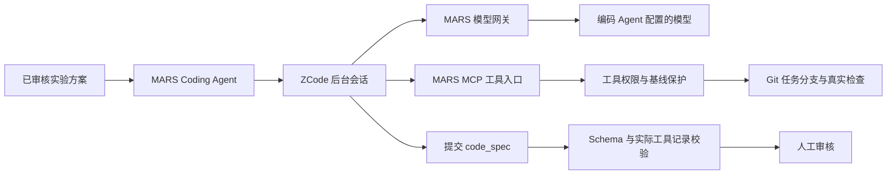

# ZCode 编码引擎接入

在 MARS 的设置页选择 ZCode 后，新启动的 Coding Agent 使用本机官方 ZCode 后台会话。研究目标、实时处理记录、代码改动、产物审核和后续实验仍由 MARS 管理。无需打开另一个编辑器。

## 使用

1. 安装 [官方 ZCode](https://github.com/zai-org/ZCode)。运行环境必须支持 `app-server`。MARS 优先使用 PATH 上的 `zcode`；macOS 也会查找官方应用内的运行入口，需要 Node.js。
2. 在 MARS 的「模型连接」中配置编码 Agent 的模型、服务地址和 API 凭据。当前本机验证使用 GLM-5.3。ZCode 无需另填上游 API Key。
3. 在「设置 → 编码引擎」选择 ZCode。设置写入本机 `.env.local`，重启后保留；已有编码调用恢复时仍使用原引擎。
4. 接入已有 Git 代码仓和资料，审核实验设计后开始编码。MARS 在原仓库中创建任务分支，ZCode 经 MARS 工具读取、修改和检查代码，完成后进入人工审核。

CLI 和前端共享编码 Agent，默认引擎为 `zcode`；已有 `.env.local` 中的明确选择仍然有效，可在设置页修改。其他研究启动参数见 [CLI 文档](cli-research.md)。缺少 ZCode 时明确提示安装，不会伪造完成或悄悄更换引擎。

每次编码调用使用独立的 ZCode 配置、用户目录和存储，禁用个人插件、技能、记忆与自动子任务；MARS 的工具连接由会话明确提供。个人 ZCode 的插件和登录配置不会被修改。用户目录隔离适配 Unix 的 `HOME` 和 Windows 的 `USERPROFILE`，属于配置隔离，不是操作系统安全沙箱。旧调用保持原引擎；要将失败的原生编码改为 ZCode，应发起新的编码重试，而非恢复旧检查点。

当前模型转发要求支持实际用量统计的 OpenAI 兼容 Provider；其他 Provider 会明确失败，不会绕过 MARS 预算直接调用。

`configs/zcode.yaml` 控制运行入口和限额。其他团队可设置明确的参数列表，例如 `command: ["/path/to/node", "/path/to/zcode.cjs"]`，MARS 会追加 `app-server`。不要填写带 shell 操作符的命令字符串。部署容器或另一台机器时，需要在后端所在环境安装运行入口。

## 执行边界



- 模型调用通过本机临时网关，沿用 MARS 的实际调用次数、用量记录和任务预算。上游凭据保留在 MARS Provider 中；ZCode 配置只含临时本机令牌，结束后删除。
- ZCode 仅获准调用宿主提供的 MARS MCP 工具。项目读写仍经过 ToolRegistry 和 Gate 5，遵守允许修改范围、受保护路径和 Git 基线。检查命令由宿主配置，模型不能传入任意 shell 命令。
- 最终结果必须提交结构化 `metadata` 和 Markdown `body`，通过 `code_spec.v1` 和编码产物验收后才能保存。运行完成、测试通过与实验有效是不同结论。
- 默认每次调用最多 24 次模型请求、40 次项目工具调用、2 次产物校验修复、900 秒活动时间；还受 MARS 更严格的任务预算限制。恢复保留原有计数和活动用时，人工等待和停机时间不计入活动用时。上游 SDK 不自动重试。
- 停止会中断网关中的请求并关闭本次拥有的 ZCode 进程及子进程。相同调用可恢复同一个 ZCode 会话；上下文、模型配置、工具权限、运行程序或配置指纹变化时拒绝直接恢复。
- 工具执行期间中断可能留下未知结果，此时禁止自动重放写操作，需要先核实文件和执行记录，再进行阶段重试。模型调用中断可能无法得到完整用量，会如实标为不完整。
- 目前支持结构化 ReAct 编码流程。若调用配置要求额外的独立审查/停止条件等不受支持能力，会明确阻断，不能静默略过。

本接入是本机可信运行程序的工具权限约束，**不是操作系统沙箱**。ZCode 会读取用户配置；若其中含 hooks、plugins 或额外 MCP，MARS 会在启动前阻断。建议使用无启动扩展的专用运行环境。未来若需要运行不可信编码程序，应另接容器或系统隔离后端。

## 验证

真实验证脚本建立独立的合成 Git 项目，不改用户研究代码，不使用模型或工具替身：

```bash
PYTHONPATH=backend .venv/bin/python scripts/validate_zcode.py --bridge
PYTHONPATH=backend .venv/bin/python scripts/validate_zcode.py --interrupt-resume
```

需要已配置的真实编码模型及官方 ZCode。第一项经过产品 Orchestrator，验证实际修改、检查、产物保存、人工审核注册和 `waiting_review`；第二项在真实工具返回后中断并恢复原会话。两项均验证基线提交不变、修改范围、Schema、预算账本及 Trace 一致性，并在各自运行目录保存 `zcode_acceptance.json`。验证不会人工批准产物或启动实验。

本机结果与具体证据见 [接入验收记录](validation/zcode-integration.md)。这些结果证明编码接入链路，不代表 StaticPIMC 的研究指标已达成，也不代替其他操作系统的实机验证。
